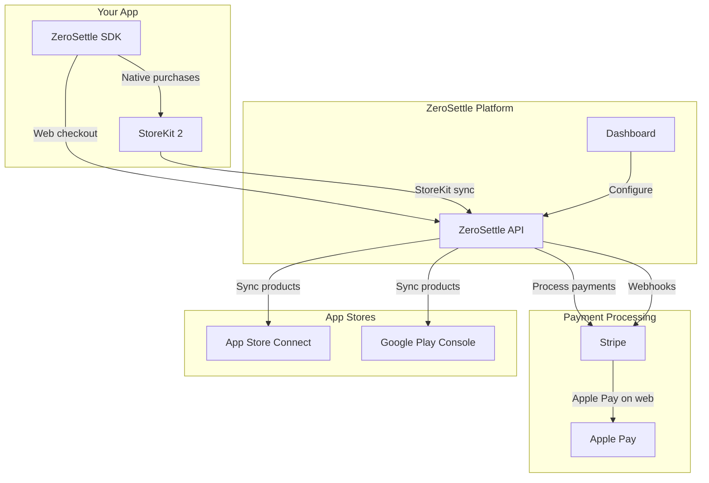
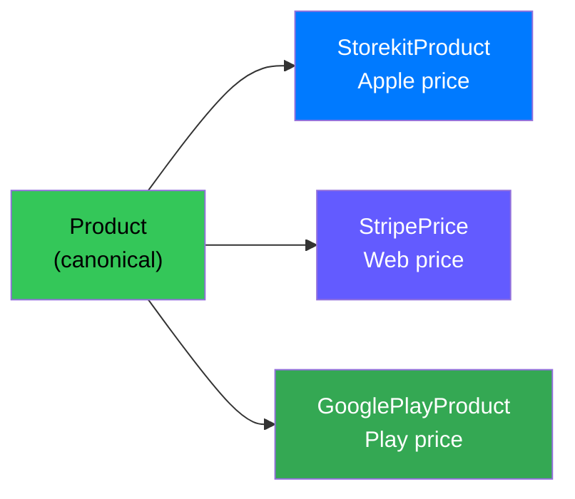

ZeroSettle In-App Purchase is a web checkout SDK for mobile apps. It processes payments via Stripe instead of Apple's StoreKit or Google Play Billing, with ZeroSettle acting as the Merchant of Record.

The platform handles payments, tax compliance, refunds, receipts, and liability. The SDK supports **Swift**, **Kotlin**, and **Flutter**, with React Native coming soon.

## Fee Comparison

| | Apple/Google IAP | ZeroSettle IAP |
| --- | --- | --- |
| **Fee** | 30% (15% for small business) | 5% + 50¢ |
| **You keep on a $9.99 sale** | $6.99 | ~$8.99 |
| **Tax handling** | Apple/Google handles | ZeroSettle handles |
| **Compliance** | Your responsibility | ZeroSettle's responsibility |
| **Payouts** | 45+ days | [Instant via Stripe](https://connect.stripe.com/express_login) |
| **Your Stripe account** | N/A | Use your own (BYOS) or ours (Managed) |

With **Bring Your Own Stripe (BYOS)**, you connect your existing Stripe account and keep your products, prices, customers, and reporting. Charges go directly to your account — ZeroSettle adds the Merchant of Record layer on top. BYOS fee is 0.5%.

## Payment Modes

Choose the integration that fits your business:

| | Managed (Default) | BYOS (Bring Your Own Stripe) |
|---|---|---|
| **Stripe account** | Created for you automatically (Express) | You connect your own (Standard) |
| **Products & prices** | Auto-created by ZeroSettle | Your existing Stripe catalog |
| **Revenue reporting** | Via ZeroSettle dashboard | Your Stripe dashboard + ZeroSettle |
| **Customer data** | Managed by ZeroSettle | In your Stripe account |
| **Setup time** | ~2 minutes | ~10 minutes (connect + map products) |
| **Fee** | 5% + 50¢ | 0.5% |

Both modes share the same SDK integration — no code differences. The only setup difference is on the dashboard.

<CardGroup cols={2}>
  <Card title="Managed Setup" icon="wand-magic-sparkles" href="/iap/dashboard#stripe-integration">
    One-click Stripe Express onboarding
  </Card>
  <Card title="BYOS Setup" icon="link" href="/iap/stripe-catalog">
    Connect your Stripe account and map your products
  </Card>
</CardGroup>

## How It Works

When a user taps "Buy" in your app, ZeroSettle presents a checkout experience powered by Stripe. The user pays with Apple Pay or a card, and your app gets a verified transaction back.

### Payment Flow

```mermaid
sequenceDiagram
    participant App as Your App
    participant SDK as ZeroSettle SDK
    participant API as ZeroSettle API
    participant Stripe as Stripe
    participant User as User

    App->>SDK: purchase(product, userId)
    SDK->>API: Create PaymentIntent
    API->>API: Check jurisdiction &amp; compliance
    API->>Stripe: Create PaymentIntent
    Stripe-->>API: PaymentIntent + client_secret
    API-->>SDK: Checkout URL
    SDK->>User: Present payment sheet
    User->>Stripe: Pay (Apple Pay / Card)
    Stripe-->>API: Webhook: payment_intent.succeeded
    API->>API: Create Transaction + Entitlement
    API-->>SDK: Transaction confirmed
    SDK-->>App: .success(transaction)
```

### Integration Architecture



There are three checkout modes, controlled server-side via remote config:

### Embedded Payment Sheet (Recommended)

`checkoutSheet` presents a native-feeling bottom sheet inside your app. It loads a WKWebView with Apple Pay and card entry. The user never leaves your app.

<CodeGroup>

```swift Swift
.checkoutSheet(item: $selectedProduct, userId: user.id) { result in
    switch result {
    case .success(let transaction):
        print("Purchased: \(transaction.productId)")
    case .failure(let error):
        print("Error: \(error)")
    }
}
```

```kotlin Kotlin
val transaction = ZeroSettle.purchase(
    activity = this,
    productId = product.id,
    userId = user.id,
)
println("Purchased: ${transaction.productId}")
```

```tsx React Native
const transaction = await ZeroSettle.purchase(product.id, user.id);
console.log(`Purchased: ${transaction.productId}`);
```

```dart Flutter
final transaction = await ZeroSettle.instance.presentPaymentSheet(
  productId: product.id,
  userId: user.id,
);
print('Purchased: ${transaction.productId}');
```

</CodeGroup>

This is the recommended approach for the best conversion rates.

### In-App Safari

Opens an `SFSafariViewController` within your app. The checkout page loads in a Safari view controller, and the result comes back via universal link.

### External Safari

Opens the checkout URL in the user's default browser. The result returns to your app via universal link. This is the fallback mode.

<Tip>
  The checkout mode is controlled by your remote config on the ZeroSettle dashboard. You can switch modes without an app update.
</Tip>

## What's Included

<CardGroup cols={2}>
  <Card title="ZeroSettle Handles" icon="shield-check">
    - **Payment processing** — Stripe-powered, Apple Pay + cards
    - **Tax compliance** — US sales tax, EU VAT, AU GST
    - **Tax remittance** — Filed and paid to authorities
    - **Merchant of Record** — ZeroSettle is the legal seller
    - **Disputes & chargebacks** — Handled automatically
    - **Refunds** — Processed automatically
    - **Receipts** — Sent to customers automatically
    - **Apple compliance** — US geofencing, required disclosures
    - **PCI compliance** — All card data handled by Stripe
  </Card>
  <Card title="You Handle" icon="code">
    - **SDK integration** — Add ZeroSettle to your app
    - **Paywall UI** — Design your purchase screens
    - **Entitlement gating** — Check access in your app logic
    - **User authentication** — Your user identity system
    - **Product catalog** — Define what you sell on the dashboard
    - **Universal links** — Required for Safari checkout flows
  </Card>
</CardGroup>

<Tip>
  Wondering how much you'd save? Try the [fee savings calculator](https://zerosettle.io/worth-the-squeeze/) to compare your revenue under Apple IAP vs ZeroSettle.
</Tip>

## What You Can Sell

- **Subscriptions** — Monthly, yearly, or custom periods
- **One-time purchases** — Premium features, content packs
- **Consumables** — Credits, tokens, virtual items
- **Non-consumables** — Permanent unlocks

### Product Architecture

Each product in ZeroSettle has a canonical identity with storefront-specific pricing:



Prices are set per storefront — your Apple price and web price can differ. The SDK shows the appropriate price based on the checkout route.

## Platform Support

| Platform | Requirements | Status |
|---|---|---|
| Swift (iOS) | iOS 17.0+, Swift 5.9+, Xcode 15.0+ | Available |
| Kotlin (Android) | Android API 26+, Kotlin 1.9+ | Available |
| Flutter | Flutter 3.3.0+, iOS 17.0+ / Android API 26+ | Available |
| React Native | — | Coming soon |

## Beyond Checkout

ZeroSettle includes a full subscription lifecycle toolkit — all configured from the dashboard with built-in A/B testing.

<CardGroup cols={2}>
  <Card title="Upgrade Offers" icon="arrow-up-right" href="/iap/upgrade-offer">
    Prompt subscribers to upgrade billing cycles with prorated savings
  </Card>
  <Card title="Switch & Save" icon="gift" href="/iap/switch-and-save">
    Migrate Apple subscribers to direct billing with discount incentives
  </Card>
  <Card title="Cancel Flows & Pause" icon="user-gear" href="/iap/customer-portal">
    Retention questionnaires, save offers, and subscription pausing
  </Card>
  <Card title="Cancel Flow UI" icon="credit-card" href="/iap/customer-portal">
    Stripe-powered subscription management for your users
  </Card>
</CardGroup>

## Get Started

<CardGroup cols={2}>
  <Card title="Account Setup" icon="user-plus" href="/iap/account-setup">
    Create your account, connect Stripe, and set up products
  </Card>
  <Card title="Installation" icon="download" href="/iap/installation">
    Add the SDK to your project
  </Card>
  <Card title="Quickstart (Swift)" icon="rocket" href="/iap/quickstart">
    SwiftUI and UIKit integration
  </Card>
  <Card title="Quickstart (Android)" icon="rocket" href="/iap/quickstart-android">
    Kotlin and Jetpack Compose integration
  </Card>
  <Card title="Quickstart (Flutter)" icon="rocket" href="/iap/quickstart-flutter">
    Cross-platform Flutter integration
  </Card>
  <Card title="Sample App" icon="mobile" href="/iap/sample-app">
    See a production app built with ZeroSettle
  </Card>
</CardGroup>
